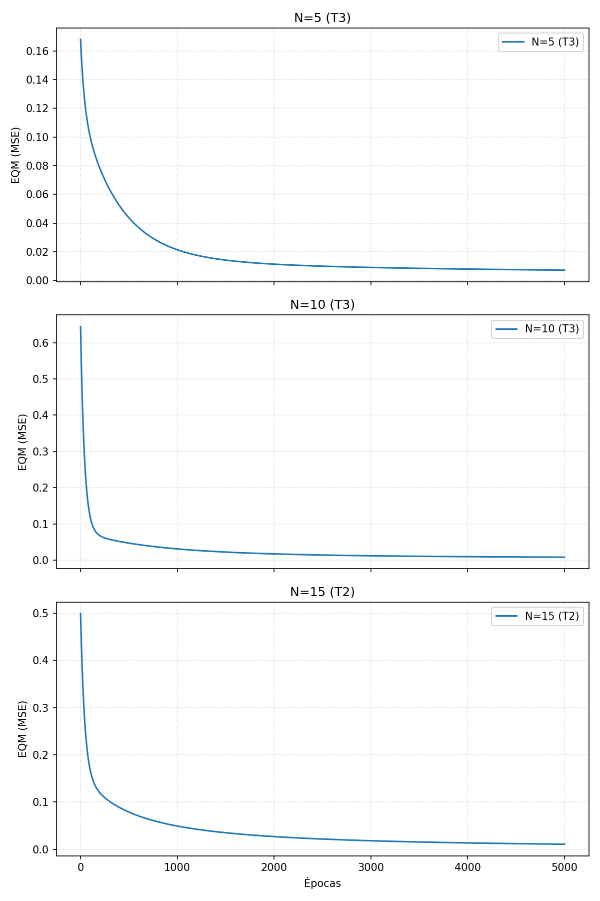

# Projeto RBF — Estimador de Injeção de Gasolina (rbf2)

Este diretório contém a implementação de uma Rede Neural de Funções de Base Radial (RBF) de 3 entradas $\{x_1, x_2, x_3\}$ e 1 saída $\{y\}$ para estimar a quantidade de gasolina a ser injetada por um sistema de injeção eletrônica de combustível.

Este projeto contrasta o desempenho de três topologias RBF:
*   **Rede 1:** $N_1 = 5$ neurônios na camada oculta.
*   **Rede 2:** $N_1 = 10$ neurônios na camada oculta.
*   **Rede 3:** $N_1 = 15$ neurônios na camada oculta.

---

## Resultados do Treinamento

| Treinamento | Rede 1 (EQM) | Rede 1 (Épocas) | Rede 2 (EQM) | Rede 2 (Épocas) | Rede 3 (EQM) | Rede 3 (Épocas) |
|-------------|--------------|-----------------|--------------|-----------------|--------------|-----------------|
| 1o (T1) | 0.014717 | 5000 | 0.008589 | 5000 | 0.013553 | 5000 |
| 2o (T2) | 0.012044 | 5000 | 0.014451 | 5000 | 0.010945 | 5000 |
| 3o (T3) | 0.007116 | 5000 | 0.008308 | 5000 | 0.013491 | 5000 |

## Validação

| Amostra | x1 | x2 | x3 | d | Rede 1 y (T1) | Rede 1 y (T2) | Rede 1 y (T3) | Rede 2 y (T1) | Rede 2 y (T2) | Rede 2 y (T3) | Rede 3 y (T1) | Rede 3 y (T2) | Rede 3 y (T3) |
|---|---|---|---|---|---|---|---|---|---|---|---|---|---|
| 01 | 0.5102 | 0.7464 | 0.0860 | 0.5965 | 0.5548 | 0.6324 | 0.5951 | 0.5496 | 0.6318 | 0.5901 | 0.4912 | 0.5068 | 0.5234 |
| 02 | 0.8401 | 0.4490 | 0.2719 | 0.6790 | 0.6696 | 0.7082 | 0.6362 | 0.6907 | 0.5649 | 0.6720 | 0.7926 | 0.7242 | 0.8177 |
| 03 | 0.1283 | 0.1882 | 0.7253 | 0.4662 | 0.5648 | 0.5256 | 0.4820 | 0.5527 | 0.4864 | 0.4706 | 0.4991 | 0.4942 | 0.5141 |
| 04 | 0.2299 | 0.1524 | 0.7353 | 0.5012 | 0.5747 | 0.5596 | 0.4924 | 0.5684 | 0.5473 | 0.4917 | 0.5531 | 0.4894 | 0.5012 |
| 05 | 0.3209 | 0.6229 | 0.5233 | 0.6810 | 0.5777 | 0.7367 | 0.6928 | 0.6098 | 0.6511 | 0.6763 | 0.7544 | 0.6172 | 0.6763 |
| 06 | 0.8203 | 0.0682 | 0.4260 | 0.5643 | 0.7017 | 0.6695 | 0.5590 | 0.5042 | 0.5051 | 0.5216 | 0.4463 | 0.4741 | 0.5312 |
| 07 | 0.3471 | 0.8889 | 0.1564 | 0.5875 | 0.5622 | 0.6863 | 0.6195 | 0.5425 | 0.5392 | 0.5397 | 0.4556 | 0.4256 | 0.4835 |
| 08 | 0.5762 | 0.8292 | 0.4116 | 0.7853 | 0.6152 | 0.7701 | 0.9304 | 0.7397 | 0.8294 | 0.8024 | 0.7336 | 0.8280 | 0.6150 |
| 09 | 0.9053 | 0.6245 | 0.5264 | 0.8506 | 0.7696 | 0.8033 | 0.8089 | 1.0221 | 0.8081 | 0.8741 | 0.9210 | 0.8248 | 0.9699 |
| 10 | 0.8149 | 0.0396 | 0.6227 | 0.6165 | 0.7539 | 0.7187 | 0.5658 | 0.6063 | 0.5095 | 0.5445 | 0.4357 | 0.5169 | 0.5022 |
| 11 | 0.1016 | 0.6382 | 0.3173 | 0.4957 | 0.4759 | 0.4802 | 0.4265 | 0.4752 | 0.4380 | 0.4752 | 0.4785 | 0.4770 | 0.5396 |
| 12 | 0.9108 | 0.2139 | 0.4641 | 0.6625 | 0.7866 | 0.7798 | 0.5936 | 0.6490 | 0.5032 | 0.5800 | 0.4845 | 0.5438 | 0.6452 |
| 13 | 0.2245 | 0.0971 | 0.6136 | 0.4402 | 0.5184 | 0.4873 | 0.4472 | 0.5196 | 0.4603 | 0.4445 | 0.5055 | 0.3836 | 0.4425 |
| 14 | 0.6423 | 0.3229 | 0.8567 | 0.7663 | 0.8102 | 0.8173 | 0.6517 | 0.7405 | 0.7867 | 0.8007 | 0.7656 | 0.7940 | 0.6264 |
| 15 | 0.5252 | 0.6529 | 0.5729 | 0.7893 | 0.6720 | 0.8437 | 0.8862 | 0.7624 | 0.8748 | 0.8953 | 0.8673 | 0.7769 | 0.7269 |
| **Erro Relativo Médio (%)** | - | - | - | - | **13.5057** | **9.8346** | **6.9720** | **8.5954** | **9.4045** | **4.8987** | **13.6835** | **9.8211** | **10.6419** |
| **Variância (%)** | - | - | - | - | **54.1380** | **29.2323** | **31.4559** | **38.3421** | **33.8500** | **19.5674** | **68.0285** | **52.2494** | **54.3285** |

## Gráficos de Treinamento

Considerando o melhor treinamento em cada topologia, podemos verificar a evolução do EQM por época de treinamento. Os melhores resultados foram obtidos por:
*   Rede 1 (N=5): T3
*   Rede 2 (N=10): T3
*   Rede 3 (N=15): T2

## Conclusão

Baseado nas análises dos itens acima, a topologia mais adequada é a **Rede 2 ($N_1=10$)** utilizando a configuração do treinamento **T3**.
Embora a Rede 1 (T3) também tenha demonstrado um bom desempenho em termos de EQM final, a Rede 2 (T3) apresentou o **menor erro relativo médio (4.8987%)** nos dados de teste e a **menor variância (19.5674%)**, o que indica uma melhor capacidade de generalização e estabilidade nas predições para o problema de mapeamento da injeção de gasolina.
